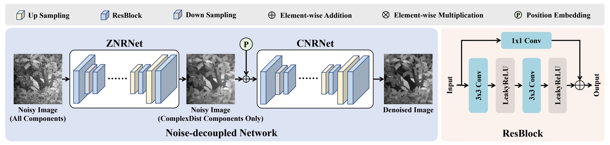

# MSFA Image Denoising using Physics-based Noise Model and Noise-decoupled Network

> [**MSFA Image Denoising using Physics-based Noise Model and Noise-decoupled Network**]()  
> Yuqi Jiang, Ying Fu, Qiankun Liu, Jun Zhang  
> IEEE T-PAMI 2023 Submission

<!--  -->

This repository contains the official code and data of the IEEE T-PAMI submission paper "MSFA Image Denoising using Physics-based Noise Model and Noise-decoupled Network", by Yuqi Jiang, Ying Fu, Qiankun Liu, and Jun Zhang.

<!-- [Paper](https://openaccess.thecvf.com/content/ICCV2023/papers/Zhang_Learning_Rain_Location_Prior_for_Nighttime_Deraining_ICCV_2023_paper.pdf) | [Supp](https://openaccess.thecvf.com/content/ICCV2023/supplemental/Zhang_Learning_Rain_Location_ICCV_2023_supplemental.pdf) | [Data](https://www.kaggle.com/datasets/zkawfanx/gtav-nightrain-rerendered-version) -->


<!-- ## Update
- [ ] Recollect misaligned data.
- **2023.12.08:** Code release.
- **2023.12.03:** Initial release of experimental data.
- **2023.08.10:** Repo created. -->

## Highlights
* We present a physics-based noise model for MSFA camera to generate high-quality synthetic data.


* We divide the overall noise of MSFA camera into SimpleDist component and ComplexDist noise component, and propose the Noise-decoupled network to sequentially remove each component.



* We collect a paired real MSFA image denoising dataset to verify the effectiveness of our proposed noise model and network.

<!--  -->


## Dataset


The experimental data used in the paper is now publicly available at [Baidu Disk](https://pan.baidu.com/s/1Rg8mwAFrPlm9PiBXeLjHCQ?pwd=9e2w) (code: `9e2w`). The collected dataset contains 150 scenes and is splited into a training set of 100 scenes and a test set of 50 scenes. Each scene contains a clean image, x10 noisy image, x20 noisy image, and x40 noisy image. All the scenes are captured using MQ022HG-IM-SM5X5 NIR 2nd Generation camera from Ximea Corporation, which is equipped with an MSFA with the size of 5x5 pattern. The total number of bands in an image is 25 ranging from 665nm to 960nm with 409x217 pixels in spatial resolution for each band. All the data are scaled to [0, 1]. Put the downloaded data to `data/scene_data_v4`.


## Requirements
- [x] Python 3.7
- [x] Pytorch 1.7.1


## Training
- Download the dataset, then put it to `./data/scene_data_v4`

- Train the model by simply run
```
bash train.sh
```


## Evaluation
- You can download the pretrained model, and put it to `exp/unet_decoupled_posemb_plus_25c_1`. Then run
```
bash test.sh
```
- Or Modify `--weights` to your `/path/to/checkpoint`. 


## Checkpoints

- Currently, only the [Noise-decoupled Net](https://pan.baidu.com/s/19aW08Rn_xTbBZirJbGxVGw?pwd=1z15) (code: `1z15`) is provided on Baidu Disk.


<!-- |   Model   | Data | PSNR  | SSIM  | Checkpoint |
| :-------: |  :--: | :---: | :---: | :---: |
|   UNet    | Real  | 36.63 | 0.9693 | [UNet_real.pth]|
|   UNet    | Synthetic  | 37.08 | 0.9715 | [UNet_syn.pth]|
| Noise-decoupled Network | Synthetic  |  38.44 | 0.9749 | [NoiseDecoupled.pth] | -->

| Ratio | Metrics | UNet (Real data) | UNet (Synthetic data) | [Noise-decoupled Net (Synthetic data)](https://pan.baidu.com/s/19aW08Rn_xTbBZirJbGxVGw?pwd=1z15) (code: `1z15`) |
| :-------: |  :--: | :---: | :---: | :---: |
| x10 | PSNR | 31.5964 | 32.0299 | 32.5345
| x10 | SSIM | 0.9619 | 0.9627 | 0.9663
| x20 | PSNR | 29.9606 | 30.6060 | 30.8542
| x20 | SSIM | 0.9495 | 0.9533 | 0.9581
| x40 | PSNR | 28.8927 | 28.7374 | 28.5878
| x40 | SSIM | 0.9352 | 0.9364 | 0.9410
| Average | PSNR | 30.1499 | 30.4578 | 30.6588
| Average | SSIM | 0.9489 | 0.9508 | 0.9551


<!-- ## Citation
If you find this repo useful, please give us a star and consider citing our papers:
```bibtex
To be done.

``` -->

<!-- ## Acknowledgement
The code is re-organized based on [Uformer](https://github.com/ZhendongWang6/Uformer) and [MPRNet](https://github.com/swz30/MPRNe). Thanks for their great works!


## License
MIT license.

CC BY-NC-SA 4.0 for data. -->